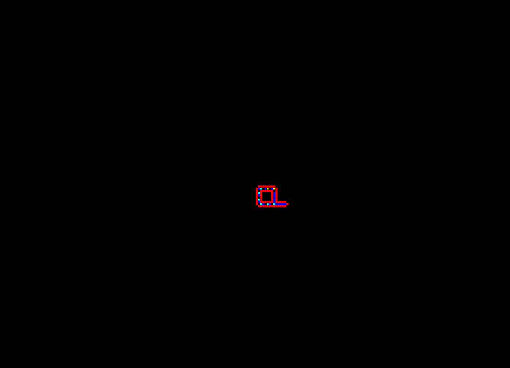
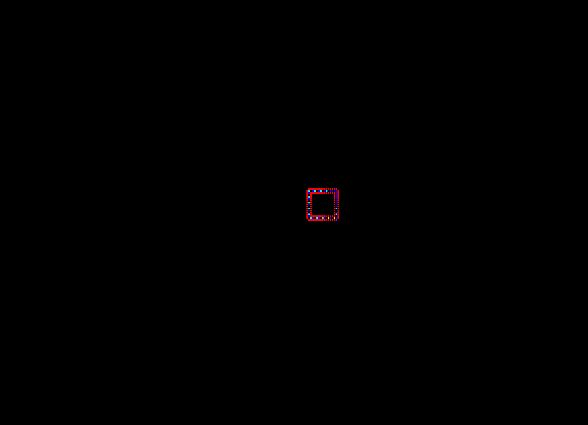

#  Self-reproduction with cellular automata in C++
This team-project simulates cellular automata on a grid.\
As described in <a href="http://www-users.york.ac.uk/~gt512/BIC/langton84.pdf">Self-reproduction in cellular automata</a>.

This project is:
- using the <a href="https://www.boost.org">boost library</a> for multithreading.
- highly configurable, able to simulate automata on a n-dimensional grid.
- implementing the observer class-structure for multiple output (bmp images, sdl window, console).

## Run the simulation
run> *alife.exe data.xml setting-id*

All automata rules, the world (initial state, size, dimension) and the wanted outputs (bmp images, sdl window, console) can be configurated in a xml file.\
Checkout data.xml and data_lab.xml for examples.\
*linux_dependencies.txt* states all dependencies needed using linux.

## Langton Loops (setting-id: 0)

## Evoloops (setting-id: 1)

